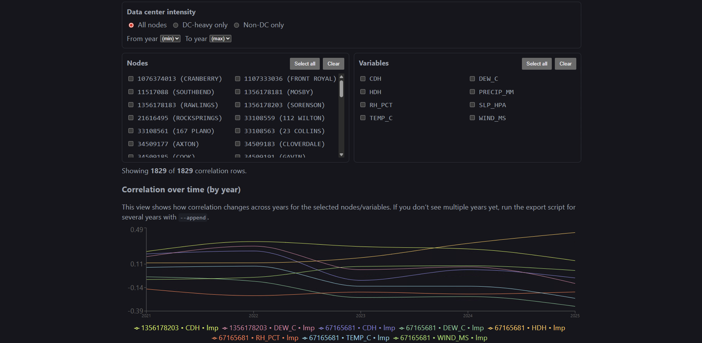
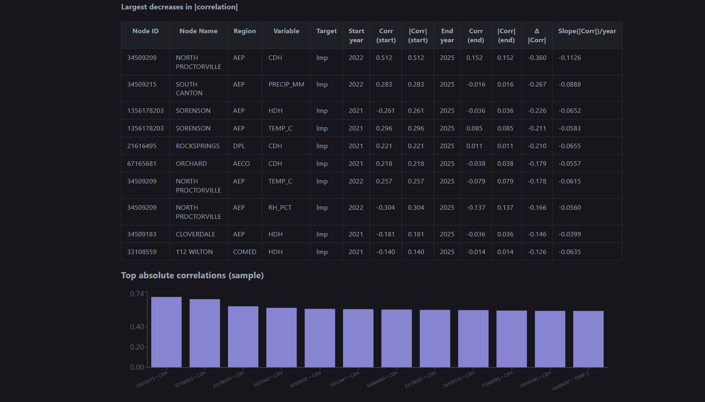
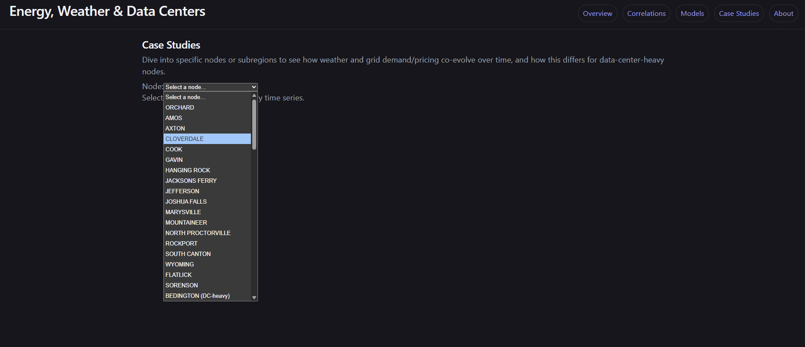

# Energy, Weather & Data Centers (PJM-focused)

React web app to explore how the relationship between **weather patterns** and **grid demand/pricing**
may be shifting in **data-center-heavy** regions.

## Run the web app (easiest solution)

```bash
npm install
npm run sync:data
npm run dev
```

Open the dev server URL (typically `http://localhost:5173/`).

You can now use the app with our precomputed correlations. If you want to go through the full pipeline of recomputing correlations from weather data and prce/energy usage information, review the following sections.

## App Screenshots

<details>
<summary>Slide 1</summary>



</details>

<details>
<summary>Slide 2</summary>


</details>

<details>
<summary>Slide 3</summary>



</details>

<details>
<summary>Slide 4</summary>



</details>

## Precomputed data (default workflow)

This repository is configured to use precomputed JSON exports so the app can run without bundling large raw PJM datasets. The remaining sections are optional.

The frontend reads from `public/data/` (synced from `data/exports/`), including:

- `regions.json`
- `nodes.json`
- `correlations_by_region_period.json`
- `model_performance.json`
- `case_studies/*.json`

To refresh frontend data from existing exports:

```bash
npm run sync:data
```

### OPTIONAL: Getting all optional app data (no recompute)

If you just want the app to work with precomputed results:

1. Download the `data` folder snapshot from Box: [Duke Box data bundle](https://duke.box.com/s/i75cw52pljlceupqarzp2vasaa31sgf7)
2. Replace your local repo `data/` directory with the downloaded `data/` directory.
3. Run:

```bash
npm run sync:data
npm run dev
```

## Recomputing correlations (optional, full data workflow)

Recomputing correlations requires raw PJM data + weather pulls. We do **not** require this for normal app usage, and we keep precomputed exports to avoid excessive data uploads/check-ins.

If you want to recompute, first download the PJM+features dataset from Duke Box:

- [Duke Box data bundle](https://duke.box.com/s/i75cw52pljlceupqarzp2vasaa31sgf7)

After downloading, extract it to the repo-relative default location:

- `./data/pjm data`

If you keep the dataset elsewhere, set an environment variable before running scripts:

```powershell
$env:PJM_DATA_ROOT="C:\path\to\pjm data"
```

We detected:
- `pjm_da_full_system_parquet/` (hourly Day-Ahead LMP by pnode)
- `pjm_load_forecast_parquet/` (hourly load forecasts by zone)
- `feature_data/` (node index, zone mapping, node coordinates)

## Integrate existing PJM metadata into the app

The React app reads static JSON under `public/data/`. Generate `regions.json`, `nodes.json`, and a
small case-study file:

```bash
python scripts/export_pjm_metadata.py
```

This writes `public/data/regions.json` and `public/data/nodes.json` (and a small case-study seed) via the normal export/sync flow.

## Pull NOAA ISD weather

Weather features are not yet present in your PJM snapshot. This script:
- downloads `isd-history.csv` (station catalog)
- finds the nearest station per node
- downloads NOAA **global-hourly** CSVs for chosen years
```bash
python scripts/noaa_isd_pull.py --years 2021 2022 2023 2024 2025 --limit-nodes 30 --max-km 50
```

Outputs:
- mapping: `data/node_to_isd_station.json`
- weather CSVs: `data/noaa_isd_global_hourly/`

After generating exports, sync them into the frontend:

```bash
npm run sync:data
```

## Next step (analysis exports)

Once weather is pulled, we’ll add a join + feature engineering script to export:
- `public/data/correlations_by_region_period.json`
- `public/data/model_performance.json`
- `public/data/case_studies/{nodeId}.json`

## RQ2 model training (weather-heavy, DC vs non-DC)

### Node categorization update (PJM-specific)

`scripts/export_pjm_metadata.py` now uses an explainable scoring system instead of zone-only assumptions.

Architecture:
- `scripts/dc_region_scoring.py` handles configurable PJM regional definitions, geography scoring, optional behavioral scoring, and confidence estimation.
- `scripts/export_pjm_metadata.py` applies that scoring to nodes and writes:
  - `data/exports/nodes.json`
  - `data/exports/regions.json`
  - `data/exports/node_dc_scoring_debug.json`

Scoring formula:

```text
data_center_likelihood_score = w_geo * geographic_score + w_behavior * behavioral_score
default: w_geo=0.70, w_behavior=0.30 (renormalized if behavioral features unavailable)
```

Label mapping:
- `high_likelihood` if score >= 0.75
- `medium_likelihood` if 0.40 <= score < 0.75
- `low_likelihood` if score < 0.40

PJM assumptions:
- Northern Virginia in `DOM` is strongest regional signal.
- Zone membership alone is insufficient; county/city/centroid proximity provides stronger evidence.
- Behavioral flatness/persistence is optional and treated conservatively.

### Rebuild metadata with new categorization

```bash
python scripts/export_pjm_metadata.py
```

Optional node attributes input (if you have county/city/state per node):

```bash
python scripts/export_pjm_metadata.py --node-attributes-csv data/your_node_attributes.csv
```

### Recompute correlations with updated categories

`scripts/build_analysis_exports.py` now sets `isDataCenterHeavyBucket` from the score-driven classification.

```bash
python scripts/build_analysis_exports.py --year 2024 --limit-nodes 15 --prefer-dc-heavy
```

### Retrain RQ2 models with updated categories

To regenerate model metrics for Research Question 2 (prediction accuracy differences between data-center-heavy and non-heavy regions), run:

```bash
python scripts/train_rq2_models.py --years 2023 2024 --limit-nodes 4 --prefer-dc-heavy --max-da-files-per-year 3 --test-start-year 2024
npm run sync:data
```

This script trains an expanded model suite (LinearRegression, Ridge, Lasso, RandomForest, GradientBoosting, ExtraTrees) for both targets:
- `lmp` (day-ahead price proxy)
- `load` (`forecast_load_mw`)

It writes metrics to:
- `data/exports/model_performance.json`
- `public/data/model_performance.json` (after `npm run sync:data`)

Each metric row includes region, period, bucket (`dc`/`nonDc`), model type (`weatherOnly`/`weatherPlusDc`), model name, sample count, RMSE, MAE, and R².

### Synthetic demo data (for quick validation)

Run demo scoring with:

```bash
python scripts/run_dc_scoring_demo.py
```

Demo inputs:
- `data/samples/pjm_nodes_synthetic.csv`
- `data/samples/pjm_timeseries_synthetic.csv`
